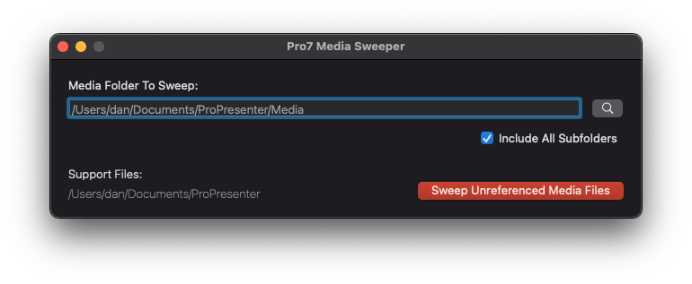

#  Pro7 Media Sweeper
### A MacOS port of [Pro7-Media-Sweeper](https://github.com/arlinsandbulte/Pro7-Media-Sweeper) by Arlin Sandbulte.

### What does it do?
It scans all your Pro7 documents in all libraries and then scans your playlists, props and themes for any references/links to media files - building a list of every media file used by your current Pro7 setup.
It then scans the "Media Folder To Sweep" that you selected to find any media files in there that are NOT used in your current Pro7 setup. ie. Not used in any docs, playlists, props, stage displays, themes etc.

Scanning for media file references is done using simple REGEX search on the binary files. Treating the binary file data as single-byte strings allows searching for simple patterns at the start and end of media file references. (See the TWO REGEX patterns used for searching.)

During the scan, any files that are not being "used" by your Pro7 setup are MOVED to "Swept Media Files" folder in your home folder - So that you now have a single folder containing all media files NOT used by Pro7.
You can then archive those un-used media files to other storage to save disk space.

Tip: If you choose to delete the un-used media files, be careful to review them first. Perhaps don't delete them right away and wait "a while!" to avoid any future deletion regrets!

This app is in early development stage - It is a working BETA that is now ready to TEST.
Until this app has been tested some more and made into a non-beta release, consider making a BACKUP COPY of any media folders you choose to scan - before scanning them!!
  
### Backstory:
This is a port of a Windows version by Arlin Sandbulte.  His version is a user-friendly AutoHotKey script.
I offered to make an AppleScript port and failed (miserably)!  So in order to somewhat honour my original offer, I made a native MacOS App (Appkit/Storyboards/Objective-C)

*Ideally if this MacOS port was done with a nice friendly scripting language it might be easier for others to understand and contribute to - but I wanted to get this done in my spare time as quick as possible.
So after failing to learn enough AppleScript to port Arlin's AHK script, I fell-back onto my "old ways" and made a native Mac App. All logic is in the ViewController (Yes, I used the "Giant ViewController" noob design pattern for this "tiny" app!) Feel free to re-write in AppleScript, JavaSript, Python etc.*

### TODO:
1. Create UNDO script for each scan
2. Consider upgrading scan from using REGEX to code that works with [ProPresenter7 Protocol Buffers](https://github.com/greyshirtguy/ProPresenter7-Proto).
