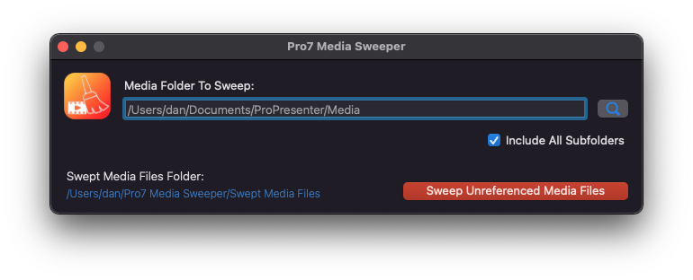

#  Pro7 Media Sweeper
### A MacOS port of [Pro7-Media-Sweeper](https://github.com/arlinsandbulte/Pro7-Media-Sweeper) by Arlin Sandbulte.

This app is in early development stage - It is a working beta that is now ready to test.
Until this app has been tested more and made into a non-beta release, consider making a BACKUP COPY of any media folders before scanning them to remove unreferenced media files.
  
### Backstory:
This is a port of a Windows version by Arlin Sandbulte.  His version was a user-friendly AHK script.
I offerred to make an AppleScript port and failed (miserably)!
So in order to honour my original offer (in some way), I made this as a native MacOS app with Appkit/Storyboards/Objective-C

*Ideally if this MacOS port was done with a nice friendly scripting language it might be easier for others to understand and contribute to - but I wanted to get this done in as little spare time as possible so I used old ways that were most comfortable for me.  Feel free to re-write in AppleScript, JavaSript, Python etc.*

### TODO:
1. Create UNDO script for each scan
2. Consider upgrading scan from using REGEX to code that works with [ProPresenter7 Protocol Buffers](https://github.com/greyshirtguy/ProPresenter7-Proto).
